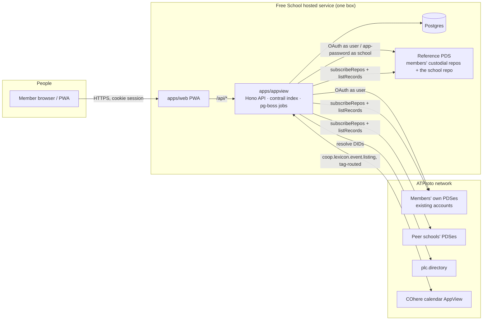

# Free School — Technical Architecture (v0.1)

*Benjamin Life (@omniharmonic) · 2026-09-12 · grounded in research briefs R1–R9 and the v0.2 research brief. Companion documents: `docs/prd.md`, `docs/implementation-plan.md`, `docs/00-stack-proposal.md`.*

## 1. System context

A free school is a **scene**, not a server: a DID that owns a policy, curates listings, and (later) owns spaces. People are DIDs on whatever PDS they like. The app is an **AppView** that indexes records from a curated registry of PDS hosts plus a set of app-side tables that hold what must never be public.

Trust boundaries, from most to least exposed:

| Boundary | What lives there | Who can read |
|---|---|---|
| Public repos (ours and others') | events, listings, skills, Tier-A skill claims, requests, resources, courses, policy, school record | everyone, forever, via any relay or Jetstream; signed and non-repudiable |
| Spaces (Phase 2) | roster, feedback, moderation | every space member, the PDS host, the authority (us), every app any member authorizes; MAC-committed so deniable on rebroadcast |
| Our Postgres (v1 home of the above + app state) | RSVPs, attendance, feedback ballots, sessions, emails, push subscriptions, invites, audit log | us, a breach, a subpoena |

Design consequence (R9): **the Postgres tier is the subpoena target, so it holds as little as possible and is structurally unable to answer the worst questions** (feedback authorship, invite tree after 30 days).

## 2. Components

### 2.1 `apps/web` — PWA
Vite + React + TypeScript, TanStack Router/Query, Tailwind 4, `vite-plugin-pwa`. Four tabs: Calendar · Skills · Requests · Me; `/admin` for stewards; `/zine` print view. Talks only to `apps/appview` on the same origin. Holds a cookie session, never tokens or keys (iOS copies only cookies at install; see §4.1). Workbox caches the app shell and the next 30 days of the home school's calendar (NetworkFirst). Install nudge after first RSVP; Declarative Web Push subscription after install.

### 2.2 `apps/appview` — API, indexer, jobs
- **Index**: `@atmo-dev/contrail` (Postgres adapter) with a projection config for `community.lexicon.calendar.event`, `.rsvp` (only when a member opts into a public RSVP), `coop.lexicon.event.config/listing/membership`, and the `freeschool.draft.*` collections, each sidecar `referencing` its event. Backfill via `listRecords` against the peer registry hosts (contrail's `relays` list is just hosts serving `listReposByCollection`). Live updates via our **`PdsChangeSource`** (a contrail `ChangeSource`) wrapping `packages/pds-follow`: one `subscribeRepos` WebSocket per peer host, per-host cursors, per-DID ordering, `#info`/`OutdatedCursor` repair, `#identity` re-resolution, `#account` status handling, `#sync` re-sync.
- **API** (Hono): auth, calendar, events, RSVP, attendance, requests, skills, skill claims, feedback, notifications, admin. Public read endpoints never enumerate members.
- **School actor**: `packages/school-actor` `AppCustodyAdapter`. Every write signed by the school DID goes through `actAs` with a required `scope`, an `audit` reason, role authorization from records, and the steward threshold for destructive actions. Nothing else holds the school session.
- **Jobs** (pg-boss): materialize series (daily), reminders (minutely, 24 h / 1 h / day-of digest with 30-min catch-up), retention sweeps, monthly newsletter, peer re-resolution.
- **Spaces-shaped store**: `packages/spaces-shim` `SpaceStore` implemented over Postgres in v1; the same interface is backed by the alpha SDK in Phase 2 (`createSpace`, `putMember`, `putRecord`, `listRecords` as viewer).

### 2.3 Reference PDS (Docker)
`ghcr.io/bluesky-social/pds`. Hosts custodial member accounts and the school account. Invite-required; the AppView mints invite codes. Handle domain is **neutral** (not `*.freeschool.com`) because the PDS endpoint in the DID document makes hosting enumerable via `plc.directory/export`.

### 2.4 Postgres
One database, two kinds of tables. **Indexed** (rebuildable from repos; contrail-managed). **App-only** (the privacy boundary): `account` (custodial credentials AES-256-GCM, key-versioned), `session`, `rsvp`, `attendance`, `feedback` + `feedback_ballot` + `feedback_event_key`, `invite`, `notification_*`, `moderation_case`, `audit`, `spaces_*` (shim), `peer_host`, `peer_repo`, `series_materialization`.

## 3. Data model

### 3.1 Records (public unless noted)
Base: `community.lexicon.calendar.event` (class or occurrence), `.rsvp` (opt-in only), `community.lexicon.location.*`. Coop: `event.config`, `event.detail` (space), `event.listing`, `membership` (space/app-side), `evaluation`, `invite`/`share` (app-side v1). Ours (`freeschool.draft.*`, 17): `skill`, `skillClaim`, `skillAttestation` (double opt-in), `skillLevel`, `series`, `occurrence`, `attendance` (space/app-side), `hostFeedback` (space/app-side), `request`, `claim`, `resource`, `course`, `policy`, `moderationAction` (space/app-side), `approval`, `appeal` (space), `school`.

Authorship: hosts write their own events into **their own repo** via OAuth (or via the school when custodial and the policy says so); the school writes listings, policy, roles, moderation, and materialized occurrences **through the actor port**. Skill references are at-uri; event references are strongRef.

### 3.2 Derived (never stored as truth)
Skill taxonomy: 525 `freeschool.draft.skill` records seeded under the taxonomy authority DID (`infra/seed/skills`), `rkey = slug`, Tier A/B flag held app-side until Lucian decides whether it belongs on the record. Events may carry zero `skillLevel` sidecars; an event with no `locations` is the "venue needed" state (R7). Role (`deriveRole` over evidence: profile, invite/vouch, confirmed attendance, hosted events, upheld negative feedback, steward appointment), badges, per-skill practitioner directory, skill pages, guild suggestions, feedback aggregates (`aggregateFeedback`, k=3 numeric / 5 text).

### 3.3 App-only (R9 defaults)
- `rsvp(event_uri, did, status, public_opt_in)` — never a repo record unless `public_opt_in`.
- `attendance(event_uri, did, participated, attested_by, at)` — collapses to counts after 90 days.
- `feedback(event_id, direction, aspects, text, date)` with **no author**; `feedback_ballot(event_id, hmac)` written in a separate transaction; `feedback_event_key` deleted at window close.
- `invite(token_hash, inviter_did, uses_left, expires_at)` — `inviter_did` nulled 30 days after redemption.
- Logs: no bodies, no DIDs/emails; IPs truncated and gone in 7 days.

## 4. Key flows

### 4.1 Sign-in (two doors)
**Primary — new identity.** `POST /api/auth/signup {email}` → magic link → AppView mints an invite code (admin) → `createAccount` on our PDS with a generated handle and a random password (encrypted at rest) → cookie session. Later: take-ownership flips `isCustodial`, user sets a password, account can migrate away (CAR export). **Secondary — existing account.** Hard confirm → `@atproto/oauth-client-node` (confidential client, DPoP, PAR) server-side → callback on our origin → cookie session. Cookies are the only storage iOS copies at Add-to-Home-Screen; the DPoP key never leaves the server, so the session survives install.

### 4.2 Create a class
Host (role ≥ 20 under the school policy) → `POST /api/events` → AppView writes `calendar.event` + `coop.lexicon.event.config` + `skillLevel` to the host's repo via their session → the PDS emits `#commit` → our `PdsChangeSource` indexes it (or the write-through hook indexes immediately) → the school (through the actor port, `curate-listing`) writes `coop.lexicon.event.listing` if the class carries a routed tag → COhere's AppView, which follows our PDS, indexes the listing. Location: `listed` events expose neighborhood only; exact address is served app-side to RSVP'd members N hours before.

### 4.3 RSVP → attendance → badge
RSVP is an app-side row (public record only on per-event opt-in with the permanence warning). After class, the host checks attendees off (`attendance` rows). Badges and the role ladder re-derive from rows; an attendee may additionally write an "I attended" record in their own repo for portability.

### 4.4 Needs board
`request` (public, in the requester's repo or the school's when custodial) ← `rsvp` rows count toward `threshold` → a host `claim`s → the app creates the class (4.2) and sets the request `status: scheduled`.

### 4.5 Anonymous feedback
Window opens at class end. Eligibility check against attendance → ballot `hmac(event_key, did)` recorded in one transaction, the feedback row (no author, date only) in another, inserted in randomized batches at window close → key destroyed → aggregate computed once and published to the host if k holds. `feedback.received` notification carries no actor.

### 4.6 Moderation
Steward proposes an action (reason mandatory) → for destructive actions a second steward writes an `approval` → `actAs('remove-listing', audit)` → the school deletes its own `event.listing` (never the author's record) → audit row → public projection is state + enum only; the reason stays in the case file behind a 2-person access rule.

### 4.7 Federation sync
Peer registry (`peer_host`, `peer_repo`, seeded from env and the `school` record's `peers`) → one `subscribeRepos` socket per host with per-host cursor → per-DID serialized processing → `listRecords` backfill on add and on `OutdatedCursor` → `#identity` triggers re-resolution and host migration → `#account` statuses mapped to row state. Ordering across hosts is never by `seq`; records order by their own timestamps.

### 4.8 Notifications
Outbox consumer (`initial: 'future'`) for record changes; minutely cron for time-based reminders. Dedup ledger with atomic claim; Postgres outbox with retry and per-channel reaping. Transports: Declarative Web Push (4 KB, `mutable: true`) and SMTP/MJML with `.ics`. Preferences are app state.

## 5. Security and privacy controls
Server-side OAuth only; `HttpOnly; Secure; SameSite=Lax` cookies; CSRF on state-changing routes; strict CSP, `Referrer-Policy: no-referrer`, no third-party scripts on authenticated pages; avatar re-encoding (EXIF/XMP/ICC stripped); rate limits per recipient/category; `noindex` on profiles; authenticated and rate-limited access to anything that lists people; school DID rotation keys generated offline with one held by a non-operator steward; published subpoena posture and a warrant canary (counsel review before launch); retention as code with tests; PITR ≤ 7 days.

## 6. Deployment
`docker compose up` = pds + postgres + appview + web (static). Boulder: one small VPS or Fly.io machine (1–2 vCPU, 2 GB) plus a neutral hostname for the PDS. Secrets in `infra/pds.env` and `.env` (never committed). Backups encrypted, retention capped. Later: `compose.selfhost.yml` for a community running its own school.

## 7. Failure modes and responses
| Failure | Effect | Response |
|---|---|---|
| Peer PDS down > 24 h | cursor outdated, silent gap | `#info` handling → `listRecords` repair; alert on `consecutive_failures` |
| School session revoked | school writes fail | actor port returns the deny envelope; stewards alerted; re-mint app password |
| Spaces alpha churn (Phase 2) | shim backend breaks | v1 Postgres backend stays as fallback; interface unchanged |
| Push subscription silently dead | no reminder | re-subscribe on launch; reminders always also in-app and by email |
| Subpoena for feedback authorship | cannot comply after window close | by design; documented posture |
| Operator compromise | signing as the school | audit log + two-steward records make fabrication detectable; PLC handover visible |

## 8. Phase 2 migration seams
1. `SpaceStore` → alpha SDK backend (two spaces: members, feedback; moderation third).
2. `SchoolActorPort` → `ArbiterAdapter` when the seven gate conditions hold (license first).
3. `PdsChangeSource` → upstream to contrail.
4. Peer registry → `school.peers` record with transitive subscription.
5. Feedback → real space only if the alpha gains guarantees that make host-unreadability real; otherwise stays app-side.

## Sources
R1–R9 (Parachute `vault/projects/local-alternatives/free-school/research/`), the v0.2 brief, `@atmo-dev/contrail` 0.23 docs, atproto.com specs, WebKit release notes as cited in R8.
